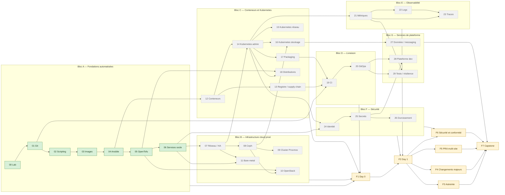

# Prérequis entre modules

> Ce fichier dit **dans quel ordre** suivre le workbook et **ce que chaque module laisse en place** pour les suivants. Les dépendances viennent de [`PLAN.md`](../PLAN.md) §5.2 et §5.3 ; les adresses, VMID et noms, de §4.5 et §4.8. En cas de doute, `PLAN.md` fait foi.

## 1. Graphe des dépendances

Une flèche `X → Y` se lit « Y suppose X terminé ». Les modules en vert sont **disponibles** ; les autres sont à venir (produits bloc par bloc). Les finaux dépendent de blocs entiers.

Lecture rapide :

- Le **bloc A** est une chaîne stricte : chaque module consomme ce que le précédent a livré (forge → outils → images → configuration → infrastructure déclarée → services socle).
- Après le module 06, deux grandes branches s'ouvrent : **infrastructure** (07 → 08 → 09, 10, 11) et **conteneurs** (12 → 14 → 15-18), qui ne se rejoignent qu'au module 16 (Ceph pour Kubernetes) et dans les finaux.
- Le module 12 ne dépend que du 04 : on peut l'aborder avant le bloc B si l'on préfère commencer par les conteneurs, à condition d'avoir le socle du module 06 en place (DNS, PKI) pour la suite.

## 2. Bloc A : ce que chaque module suppose et ce qu'il laisse en place

Le contrôle d'entrée d'un module est le **mini-projet du module précédent** : `lab/bin/check <NN-1> <dernier exercice>` doit être vert (par exemple `lab/bin/check 05 46` avant le module 06). Tous les fichiers de `~/.config/workbook/` sont sur `adm01`, dans un dossier en 700, en 600, jamais dans un dépôt.

| Module | Suppose acquis | Hôtes et objets Proxmox laissés en place | Projets GitLab | Comptes et jetons | Fichiers sous `~/.config/workbook/` |
|---|---|---|---|---|---|
| **00** Lab | Administration Linux et réseau (évaluée en E01, E02) ; `pve01` installé ; photos de `hp01` à préserver | `pve01` préparé : stockages `local-nvme`, `ssd-lab`, `hdd-bulk`, pool `lab`, bridge `vmbr1`, zone SDN `lab` et ses VNets ; `gw01` (1000, routeur nftables, NAT, NTP, WireGuard `wg0`/`wg1`) ; `adm01` (1001, 10.10.10.10) ; `dns01` (1002, 10.10.20.10, dnsmasq DNS + DHCP du VLAN 99) ; template 9000 `tpl-debian13` ; `hp01` réinstallé en `pbs01` (PAR2, 10.20.10.10, datastore `ds-lab`, stockage `pbs-par2`) | aucun (dépôt Git **local** `~/medisphere`, étiqueté `socle-v0`) | Proxmox : `wb-admin@pve` (groupe `wb-admins`), `wb-automation@pve!lab` (rôle `WBAutomation`) | `pve-api.env` (E17), `pve-root-ca.pem` (copie de l'autorité de `pve01`, E17) |
| **01** Git | M00-E50 vert ; agent SSH chargé ; `lab/lab.env` sur `adm01` | `git01` (1004, 10.10.20.12, GitLab CE 19.4) ; `runner01` (1007, 10.10.20.15, exécuteur `shell`, étiquettes `shell` et `socle`) ; CA provisoire dans `~/pki-provisoire/` ; Node.js 24 sur `adm01` et `runner01` ; sauvegarde de GitLab vers `pbs01` (secrets dans `/etc/wb-backup/` de `git01`) | `plateforme/medisphere` (ex-`~/medisphere`, ADR-0010…, RB-010 à RB-013), `plateforme/ci-templates` (`qualite.yml`, `release.yml`) ; groupe `formation` (bac à sable) | GitLab : `root` (bris de glace), `<MOI>` (admin), `claire.morel`, `karim.benali`, `sophie.laurent`, `julien.petit`, `nadia.roussel`, `lucas.martin` ; jeton `glrt-` du runner | `gitlab-checks.token` (`read_api`), `gitlab-admin.token` (`api`, courte durée ; `admin_mode` à partir de E31) |
| **02** Scripting | Forge, runner, pre-commit et semantic-release du M01 | Outils sur `adm01` et `runner01` (ShellCheck 0.11, shfmt, jq 1.8, yq mikefarah, uv, Task, bats) ; `medictl` installé depuis le registre de paquets ; timer `ms-verif-sauvegardes` sur `adm01` ; étiquettes Proxmox `socle` / `role-…` sur les VMs du socle | `plateforme/outils` (`bin/ms-*`, `lib/ms-commun.sh`, `medictl`, releases `vX.Y.Z`) ; ADR-0020 dans `plateforme/medisphere` | Proxmox : jeton en lecture seule `wb-automation@pve!lecture` | `pve-root-ca.pem` remplacé par l'ancre conforme (E08), `pve-lecture.env`, `pbs-lecture.env` (E26) |
| **03** Images | `plateforme/outils` et sa CI ; template 9000 | Packer 1.16 sur `adm01` puis `runner01` ; ancre de `pve01` dans le magasin système (`pve01-root-ca.crt`) ; templates 9001 `tpl-debian13-base`, 9002 `tpl-rocky10-base`, images dorées 9010-9029 (Debian 13) et 9030-9049 (Rocky 10), étiquette `current` sur une version par famille ; flux `vsandbox` → `adm01`/`runner01` TCP 8100-8199 et `runner01` → `pve01` 8006 (IPSet `automation`) | `plateforme/images` (build hebdomadaire planifié) ; ADR-0030, RB-030, RB-031 | Proxmox : `wb-packer@pve!packer` (rôles `WBPacker`, `WBLectureISO`) | `pve-packer.env` |
| **04** Ansible | Images dorées `current` ; outils et CI des M01-M02 | Configuration du socle **en code** (rôles `base`, `ssh_durci`, `pare_feu` pour `gw01`, `gitlab_runner`, `dnsmasq`, rôle de l'hôte `git01`) ; inventaire dynamique Proxmox ; `sem01` (2041) **détruite** en fin de module ; flux `runner01` → `adm01`/`gw01` TCP 22 | `plateforme/ansible` (collection `medisphere.socle`, Molecule, pipeline d'application protégé, détection de dérive planifiée) ; ADR-0040, RB-040, RB-041 | Proxmox : `wb-ansible@pve!ansible` (rôles `WBAnsible`, `WBAnsibleCluster`) ; clé SSH `ansible-ci` du pipeline | `pve-ansible.env`, `ansible-vault.pass` (identité `lab`), `ansible-vault-critique.pass` (identité `critique`) ; `semaphore-checks.token` (inutile après la destruction de `sem01`) |
| **05** OpenTofu | Rôles Ansible et inventaire dynamique du M04 ; image dorée `current` | `s3-01` (1006, 10.10.20.14, SeaweedFS, S3 HTTPS sur 8333, compartiment `tofu-state` versionné) ; OpenTofu 1.13 sur `adm01` et `runner01` ; socle (`adm01`, `dns01`, `git01`, `runner01`, `s3-01`) décrit dans l'état `socle`, `prevent_destroy` ; `gw01` hors IaC (ADR-0051) ; VMs 2050-2059 détruites | `plateforme/infra` (plan en MR, apply protégé, dérive planifiée), `plateforme/tofu-modules` (module `vm-debian`, versions `vX.Y.Z`) ; ADR-0050, ADR-0051, RB-050, RB-051 | Proxmox : `wb-tofu@pve!tofu` (rôle `WBTofu`) ; identité S3 d'OpenTofu sur `s3-01` | `pve-tofu.env`, `s3-tofu.env`, `s3-admin.env`, `tofu-chiffrement.pass` |
| **06** Services socle | Pipelines de `plateforme/infra` et `plateforme/ansible` (M05-E46 vert) | `ca01` (1003, 10.10.20.11, step-ca, ACME, CA SSH) ; `nbx01` (1005, 10.10.20.13, NetBox 4.6) ; `dns02` (1008, 10.10.20.16) ; `dns01` passé à PowerDNS (autoritaire + récurseur) et Kea DHCP en HA avec `dns02` ; **dnsmasq et CA provisoire retirés** ; racine de la PKI hors ligne dans `~/pki-racine` (chiffrée) ; NTS sur `gw01` ; certificats SSH d'hôte et d'utilisateur ; documentation étiquetée `socle-v1` | Rôles `step_ca`, `netbox`, `powerdns_auth`, `powerdns_recursor`, `kea_dhcp4`, `kea_ddns`… dans `plateforme/ansible` ; NetBox devient l'inventaire Ansible par défaut ; synchronisations dans `plateforme/outils` ; ADR-0060, RB-060 à RB-064 | NetBox : `wb-checks`, `<MOI>`, `svc-automatisation`, `svc-supervision` ; step-ca : provisioners `admin`, `acme`, `sshpop` ; Kea : `kea-api`, `supervision` | `step-admin.pass`, `netbox-checks.token`, `netbox-moi.token`, `netbox-auto.token`, `netbox-tofu.env`, `netbox-ansible.env`, `netbox-supervision.token`, `powerdns-api.env`, `kea-supervision.env` |

### État d'entrée du bloc B

À la fin du bloc A, le **socle v1** comprend neuf VMs permanentes (`gw01`, `adm01`, `dns01`, `ca01`, `git01`, `nbx01`, `s3-01`, `runner01`, `dns02`) et `pbs01` sur PAR2 ; toute nouvelle VM passe par OpenTofu (`plateforme/infra`), est configurée par Ansible (`plateforme/ansible`), reçoit son adresse de NetBox, son nom de PowerDNS et ses certificats de step-ca. Le contrôle `lab/bin/check 06 46` vérifie l'ensemble, y compris les acquis des modules 01 à 05.

### Variables de `lab/lab.env` du bloc A

`lab/lab.env.example` fait référence. Variables utilisées par les vérifications et les pannes des modules 00 à 06 : `WB_PVE_HOST`, `WB_PBS_HOST`, `WB_SSH_OPTS`, `WB_TIMEOUT`, `WB_LAN_MAISON`, `WB_PBS_LAN`, `WB_STORAGE_NVME`, `WB_STORAGE_SSD`, `WB_STORAGE_BULK`, `WB_PHOTOS_DIR`, `WB_PHOTOS_FULLCHECK` (M00) ; `WB_DEPOT`, `WB_SRC`, `WB_MOI`, `WB_GITLAB_URL`, `WB_GITLAB_TOKEN_FILE`, `WB_GITLAB_ADMIN_TOKEN_FILE` (M01) ; `WB_SEMAPHORE_URL`, `WB_SEMAPHORE_TOKEN_FILE` (M04) ; `WB_S3_ENDPOINT` (M05) ; `WB_NETBOX_URL`, `WB_NETBOX_TOKEN_FILE` (M06).
