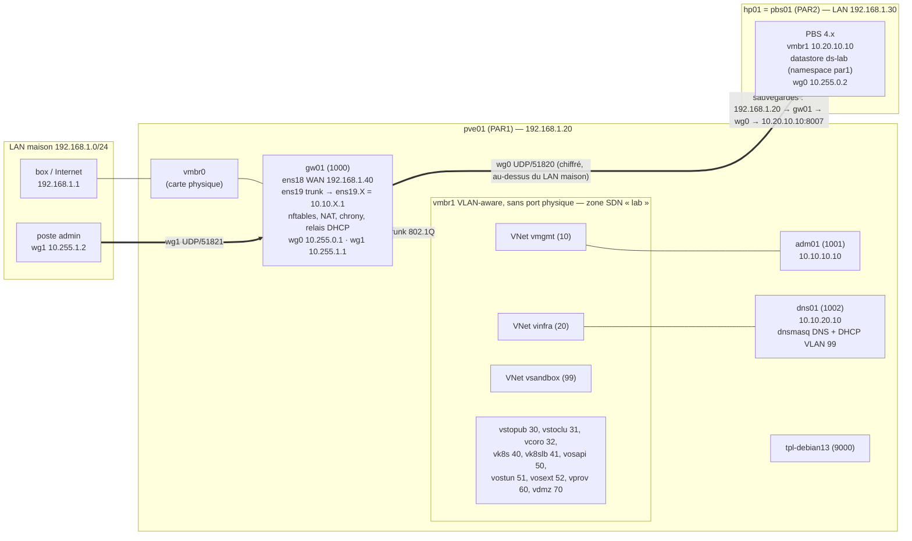

# Architecture du socle v0

> Exemple de corrigé M00-E50. Valeurs d'exemple : `<LAN-MAISON>` = 192.168.1.0/24,
> `<IP-PVE01>` = 192.168.1.20, `<IP-HP01-LAN>` = 192.168.1.30, `<IP-GW01-WAN>` = 192.168.1.40.

## 1. Schéma réseau



Le diagramme est en Mermaid : GitLab (module 01) l'affichera directement. Une version ASCII
reste lisible dans un terminal :

```
 Internet ── box ── LAN maison 192.168.1.0/24 ──┬── pve01 .20 ── vmbr0 ── gw01 ens18 .40
                                                │                         │  nftables / NAT
                                                │                         ├─ ens19 (trunk) ── vmbr1 (zone SDN « lab »)
                                                │                         │     ├─ vmgmt  (10) ── adm01 10.10.10.10
                                                │                         │     ├─ vinfra (20) ── dns01 10.10.20.10
                                                │                         │     └─ vsandbox (99) ── VMs jetables (DHCP relayé)
                                                │                         ├─ wg1 10.255.1.1 ◄── poste admin (UDP/51821)
                                                └── hp01 .30 (pbs01) ◄════ wg0 10.255.0.1 ⇄ 10.255.0.2 (UDP/51820)
                                                     └─ vmbr1 10.20.10.10 (PBS, ds-lab)
```

## 2. Composants

| Composant | Rôle | Configuration de référence |
|---|---|---|
| `vmbr1` + zone SDN `lab` | segmentation L2 du lab, 13 VNets (PLAN §4.3 bis) | M00-E09, M00-E28 |
| `gw01` | routage inter-VLAN, filtrage (politique `drop`), NAT sortant, NTP, relais DHCP, VPN, tunnel | `/etc/nftables.conf` (M00-E26), `wg0.conf`, `wg1.conf` |
| `dns01` | DNS faisant autorité (`par1`, `par2`) et récursif, DHCP du VLAN 99 | `/etc/dnsmasq.d/medisphere.conf` |
| `adm01` | poste d'administration, point d'entrée des vérifications | `~/.ssh/config` (adresses IP), `~/DevOpsPrivateCloud` |
| `pbs01` | sauvegarde hors site, chiffrée côté client, rétention et vérification | datastore `ds-lab`, namespace `par1` |
| Pare-feu Proxmox | protection de l'interface d'administration de `pve01` | `cluster.fw`, IPSet `management` (M00-E27) |

## 3. Chemins critiques

- **Sauvegarde** : `pve01` (192.168.1.20) → `gw01` `ens18` → `wg0` (masquerade en 10.255.0.1) → `pbs01` 10.20.10.10:8007. Dépend de : `gw01`, tunnel, route statique 10.20.0.0/16 sur `pve01`, PBS.
- **Résolution de noms** : toutes les VMs → 10.10.20.10 → (récursion) `<DNS-AMONT>` via NAT de `gw01`.
- **Temps** : `gw01` ← pool Internet ; VMs ← passerelle de leur VLAN ; `pbs01` ← `gw01` via le tunnel.
- **Administration** : poste → (route statique ou `wg1`) → `adm01` ; `adm01` → SSH (root vers `pve01`/`pbs01`, `admin` + `sudo` vers les VMs).

## 4. Points uniques de défaillance

Voir le tableau des risques du [README](README.md). La perte de `gw01` coupe à la fois l'accès,
le DNS récursif, le temps et les sauvegardes : c'est la priorité du module 07.
