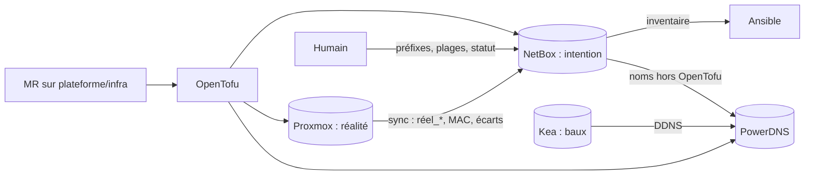

# ADR-0060 — Faire de NetBox la source de l'intention, et de chaque outil le témoin de sa réalité

- Statut : accepté
- Date : AAAA-MM-JJ
- Décideurs : Claire Morel (responsable infrastructure), équipe Plateforme
- Consultés : Karim Benali, Sophie Laurent (RSSI), Julien Petit (équipes de développement)

## Contexte et problème

Cinq systèmes « savent » quelque chose d'une VM du socle : NetBox (M06-E04), Proxmox (réalité d'exécution), l'état OpenTofu `socle` (M05), PowerDNS (M06-E06) et Kea (M06-E16). Des synchronisations existent dans plusieurs sens : Proxmox → NetBox (`medictl netbox sync`, M06-E11), NetBox → OpenTofu (adresses, M06-E13), OpenTofu → PowerDNS (M06-E14), NetBox → PowerDNS (M06-E15), Kea → PowerDNS (DDNS, M06-E17), NetBox → Ansible (inventaire, M06-E12). Incident du ticket PLAT-757 : une adresse corrigée dans NetBox par Karim et dans le code OpenTofu par Julien, puis réécrite dans NetBox par la synchronisation de nuit. Il faut décider, information par information, qui fait foi, qui écrit, et que faire d'un écart.

## Facteurs de décision

- Traçabilité HDS / ISO 27001 : chaque changement d'actif a un auteur, une date, une revue.
- Un seul écrivain automatique par information (sinon les outils se battent, comme dans l'incident).
- Les modules suivants s'appuient dessus : bare-metal depuis NetBox (M11), Kubernetes et ExternalDNS (M15), supervision (M21).
- Capacité d'une petite équipe : pas plus de synchronisations que nécessaire, chacune idempotente et avec `--dry-run`.
- Continuité : NetBox indisponible ne doit pas arrêter le DNS ni le DHCP (plan de contrôle ≠ plan de données).

## Options envisagées

1. **NetBox fait foi pour l'intention** ; le code et les outils en découlent ; les outils écrivent la réalité observée à côté, jamais par-dessus.
2. **Le code (Git) fait foi pour tout** ; NetBox n'est qu'un reflet en lecture, alimenté par le code et les outils.
3. **Chaque outil fait foi pour son domaine** (Proxmox pour les VMs, PowerDNS pour les noms, Kea pour les baux) avec des synchronisations croisées bidirectionnelles.

## Décision

Option retenue : **1, « NetBox fait foi pour l'intention »**, avec une précision : l'intention se modifie **par MR** quand elle est portée par du code (OpenTofu crée les objets NetBox d'une VM du socle), et **dans NetBox** quand aucun code ne la porte (préfixes, plages, VLANs, sites). La réalité observée (Proxmox, baux Kea) n'écrase jamais l'intention : elle est consignée à côté et les écarts sont **signalés**.

| Information | Source qui fait foi | Écrit par | Copies (lecture) | Sens |
|---|---|---|---|---|
| Existence d'une VM du socle, VMID, ressources visées | NetBox (objets créés par OpenTofu, `socle/*.tf`) | OpenTofu (pipeline `plateforme/infra`) | Proxmox (réalité), inventaire Ansible | Git → OpenTofu → NetBox **et** Proxmox |
| Adresse IP d'une VM du socle | NetBox (adresse réservée ou allouée, M06-E13) | OpenTofu (même ressource que la VM) | cloud-init de la VM, PowerDNS (A/PTR), Ansible (`ansible_host`) | NetBox → OpenTofu → VM, PowerDNS |
| Nom DNS (A, PTR) d'une VM du socle | NetBox (`dns_name` de l'adresse) | OpenTofu (`powerdns_record`) ; la synchronisation NetBox → PowerDNS (M06-E15) **seulement** pour les noms qu'aucun code OpenTofu ne porte (hôtes importés en M05, `pbs01`) : chaque *rrset* a un seul propriétaire, inscrit dans son commentaire PowerDNS | PowerDNS, récurseurs | NetBox → PowerDNS |
| Rôle, étiquettes | NetBox (étiquettes `socle`, `role-*`) | OpenTofu (identiques aux étiquettes Proxmox) | Proxmox (étiquettes), inventaire Ansible (groupes) | NetBox/Git → Proxmox |
| Inventaire Ansible (hôtes, groupes, `ansible_host`) | NetBox : inventaire **par défaut** du projet (`inventories/lab/netbox.yml`, M06-E12) | — (lu par le plugin `nb_inventory`, jeton en lecture) | inventaire Proxmox (M04), contrôle de cohérence en CI (`comparer-inventaires.sh`) et secours si NetBox est indisponible | NetBox → Ansible |
| Statut (planifiée, active, décommissionnée) | NetBox | humain (planned, decommissioning) ou OpenTofu (active à la création) | — | NetBox seul |
| Ressources **réelles** (CPU, mémoire, disque effectifs), état d'exécution | Proxmox | Proxmox | NetBox, champ personnalisé `reel_*` et journal (M06-E11) | Proxmox → NetBox (à côté, jamais à la place) |
| Adresse MAC | Proxmox (générée à la création) | Proxmox | NetBox (interface), par la synchronisation | Proxmox → NetBox |
| Bail DHCP d'une VM sandbox, nom `sbxNN` | Kea (baux) | Kea, DDNS | PowerDNS | Kea → PowerDNS ; **jamais** dans NetBox (éphémère) |
| Certificat d'un hôte | step-ca (base de `ca01`) | ACME (`cert-renewer`) | supervision (M06-E29) | `ca01` → hôte |
| Préfixes, VLANs, plages (statique, DHCP, VIP) | NetBox | humain, par l'interface, journal de modifications | Kea (plage du VLAN 99, recopiée en variable : à générer depuis NetBox, action 3) | NetBox → Ansible |

### Écarts, suppression, droits

- **Détection** : la synchronisation Proxmox → NetBox (M06-E11) tourne chaque nuit en mode **comparaison** : elle écrit la réalité dans les champs `reel_*` et, si l'intention diffère (IP, ressources, étiquettes), pose l'étiquette `ecart` et le signale (journal, alerte `ms-alerte`). `tofu plan` planifié (détection de dérive, M05) signale l'autre sens. Personne ne « gagne » automatiquement : l'astreinte décide, puis corrige **la source** (MR ou NetBox).
- **Cas de Karim et Julien rejoué** : l'adresse d'une VM du socle est écrite par OpenTofu ; Karim n'a pas à la modifier dans NetBox. Ses droits NetBox ne le lui permettent d'ailleurs plus (objets étiquetés `iac` en lecture seule pour les humains, permission par contrainte d'objet). Il ouvre une MR ; Julien la relit. La synchronisation, elle, n'écrit plus jamais le champ « adresse ».
- **Suppression** : une VM disparue de Proxmox n'est **pas** supprimée de NetBox par la synchronisation : elle passe en statut `failed` avec l'étiquette `ecart`. La suppression d'une VM du socle est un `tofu destroy` ciblé (MR) qui retire VM, objets NetBox et enregistrements DNS ensemble ; pour une VM sandbox, rien n'est dans NetBox.
- **Droits** (registre des secrets) : jeton NetBox d'écriture `netbox-auto` réservé au pipeline `plateforme/infra` et à la synchronisation (objets VM et adresses seulement) ; jeton des checks et de la supervision en lecture ; clé d'API PowerDNS réservée à OpenTofu et à la synchronisation NetBox → PowerDNS ; TSIG `ddns-kea` réservé à Kea.

### Conséquences

- Positives : un seul écrivain automatique par information ; l'incident PLAT-757 devient impossible par construction ; NetBox est fiable pour M11 (bare-metal) et M15 (ExternalDNS) ; tout changement d'actif a une MR ou une entrée du journal de NetBox.
- Négatives : une correction urgente d'adresse passe par une MR et un pipeline (quelques minutes de plus) ; deux mécanismes de détection d'écart à maintenir (synchronisation et `tofu plan`) ; la plage DHCP du VLAN 99 est encore recopiée dans une variable Ansible ; si NetBox est indisponible, on ne peut **rien créer** (le DNS et le DHCP continuent de fonctionner).
- Actions induites : (1) permissions NetBox par contrainte d'objet sur l'étiquette `iac` (M06, ticket SEC à ouvrir) ; (2) mode comparaison et étiquette `ecart` dans `medictl netbox sync` ; (3) générer `kea_dhcp4_sous_reseaux` depuis NetBox (M06-E46) ; (4) alerte sur `ecart` reprise par Alertmanager (M21) ; (5) jetons et clés gérés par Vault/OpenBao avec rotation (M25) ; (6) NetBox source des serveurs physiques (M11).

## Analyse des options

### Option 1 — NetBox fait foi pour l'intention
- Pour : modèle standard de NetBox (« source de vérité de l'intention ») ; humains et outils lisent le même endroit ; prépare M11/M15 ; l'interface sert aux équipes non techniques (inventaire HDS).
- Contre : NetBox devient critique pour tout changement ; demande une discipline de droits (sinon retour à l'incident) ; les objets portés par du code doivent être protégés contre l'édition manuelle.

### Option 2 — Git fait foi pour tout
- Pour : revue systématique, historique Git, aucune donnée hors Git.
- Contre : préfixes, plages, câblage et matériel en code deviennent lourds à maintenir ; NetBox perd son intérêt (simple affichage) ; les équipes non techniques ne peuvent rien consulter ni demander ; l'allocation d'adresses « la première libre » demande un IPAM de toute façon.

### Option 3 — Chaque outil fait foi pour son domaine, synchronisations croisées
- Pour : aucun outil central critique ; chaque équipe garde son outil.
- Contre : c'est exactement la situation de l'incident ; les synchronisations bidirectionnelles produisent des boucles et des « derniers écrivains » imprévisibles ; aucune vue d'ensemble fiable pour l'audit.

## Liens

- Tickets PLAT-757 (cet ADR), PLAT-750, PLAT-751 ; ADR-0040 (exécution Ansible), ADR-0050 (état OpenTofu).
- `docs/socle/services.md`, RB-060 (ajouter un hôte au socle).
