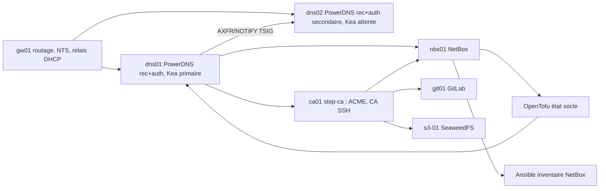

# Services socle MédiSphère (socle v1)

> Modèle de référence pour M06-E46 (`docs/socle/services.md`). Les valeurs entre `<…>` sont à remplacer par **tes** mesures et emplacements ; aucune valeur secrète ne figure ici, seulement des emplacements (registre : `docs/socle/registre-secrets.md`).

Version : socle-v1 — Date : AAAA-MM-JJ — Responsable : équipe Plateforme (Claire Morel).

## 1. Carte des dépendances

Ordre de reprise après coupure totale : `gw01` → `dns01`/`dns02` → `ca01` → `nbx01` → `git01`/`runner01`/`s3-01` (ordre de démarrage Proxmox aligné).

## 2. Fiches de service

| Service | Hôtes | Ports | Données (sauvegarde) | Secrets (emplacement) | Supervision | Si le service tombe |
|---|---|---|---|---|---|---|
| Récurseur DNS | dns01, dns02 | 53 UDP/TCP | aucune (configuration en code) | — | sonde résolution + `ad` | clients basculent sur l'autre résolveur (délai du résolveur système) ; SERVFAIL/NXDOMAIN ne basculent pas tous |
| Autoritaire DNS | dns01 (primaire), dns02 (secondaire) | 5300, API 8081 (filtrée) | base `<gsqlite3/LMDB>` → PBS `par1/dns01` | clé d'API, TSIG `axfr-par1`, `ddns-kea` : Vault `critique` | série identique, `pdnsutil zone check` | le secondaire sert la zone jusqu'à `expire` du SOA ; plus de mise à jour (DDNS, OpenTofu) |
| DHCP Kea | dns01 (primaire), dns02 (attente) | 67 UDP | baux `memfile`, configuration → PBS | identifiants du socket de contrôle : Vault | sonde DHCP, état HA | bascule *partner-down* ; baux en cours conservés |
| DDNS | dns01 (`kea-dhcp-ddns`) | 53001 (local) | — | `ddns-kea` | bail ↔ nom | nouveaux baux sans nom |
| PKI | ca01 | 443 | `/etc/step-ca` sans clé racine → PBS `par1/ca01` ; racine hors ligne `<emplacement>` | mots de passe intermédiaire et provisioners : Vault `critique` | `/health`, expiration < 10 j | aucune émission ni renouvellement ; les certificats valides restent valides |
| NetBox | nbx01 | 443 | `pg_dump` → PBS `par1/nbx01` | `SECRET_KEY`, `API_TOKEN_PEPPERS`, jetons : Vault `critique` | `/api/status/` | plus de synchronisation, d'allocation d'adresse ni d'inventaire NetBox (repli : inventaire Proxmox) |
| Temps | gw01 (NTS vers Internet, serveur du lab) | 123, 4460 | — | certificat NTS (ACME) | écart d'horloge | les hôtes dérivent lentement ; TLS, TSIG et certificats SSH sensibles au-delà de quelques minutes |

## 3. Procédures

Runbooks : RB-060 (ajouter un hôte au socle), `<RB-06x>` (DNS : un nom ne se résout plus), `<RB-06x>` (certificat refusé), `<RB-06x>` (restauration d'un service socle), RB-050 (verrou d'état OpenTofu).

## 4. Points uniques de défaillance et suite

- `ca01` seul : émission et renouvellement impossibles pendant la panne ; tolérance = durée de vie restante des certificats (> 10 jours garantis par la supervision).
- `nbx01` seul : pas de redondance de NetBox ; repli documenté sur l'inventaire Proxmox (ADR-0060).
- `gw01` seul : routage, NTS et relais DHCP (bloc B, M07 : `gw02` + VRRP).
- Clé racine hors ligne : procédure de cérémonie testée le `<date>`.

## 5. Mesures

Test de restauration du `<date>` : `<service>`, RTO `<min>`, RPO `<h>` (détail : `tests/restauration.md`).
