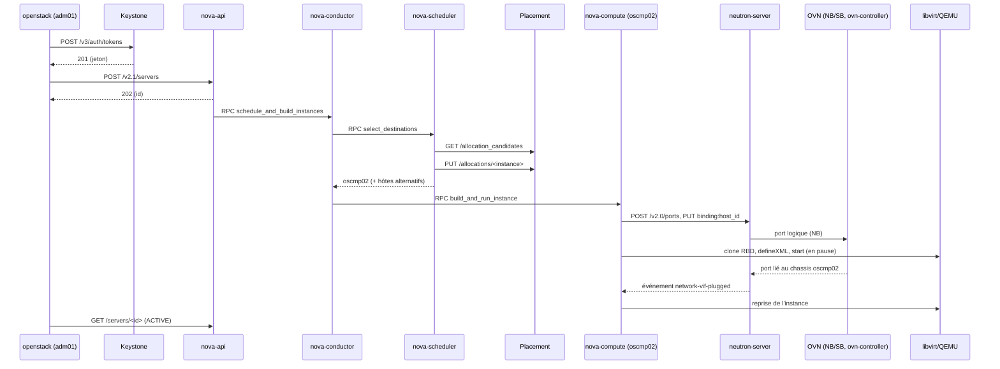

# La vie d'un `openstack server create`

> Compte rendu de M10-E44 (ticket PLAT-1180). Cloud PAR1, OpenStack 2026.1 déployé par Kolla-Ansible 22, Neutron ML2/OVN, stockage `ceph-par1`. Instance de traçage `m10-e44-trace` (projet `plateforme`, `m1.petit`, Debian 13), placée sur `oscmp02`. Identifiants, horodatages et adresses sont ceux d'un essai ; les tiens différeront. Aucun jeton n'est reproduit (les en-têtes `X-Auth-Token` sont masqués).

## Requête et identifiants

Commande : `openstack --debug server create --flavor m1.petit --image debian-13 --network plateforme-net --key-name ma-cle --wait m10-e44-trace` (sortie filtrée, jeton masqué).

| Étape | Requête | Réponse | Identifiant |
|---|---|---|---|
| Authentification | `POST https://openstack.par1.medisphere.internal:5000/v3/auth/tokens` | `201`, en-tête `X-Subject-Token: {SHA256}…` | `req-5d0e…` (Keystone) |
| Catalogue | (inclus dans la réponse) | point d'accès `compute` public, port 8774 | — |
| Création | `POST https://openstack.par1.medisphere.internal:8774/v2.1/servers` | `202`, corps : `id`, `links`, `adminPass` (si non désactivé) | `x-openstack-request-id: req-2b6f8c1e-…` |
| Attente (`--wait`) | `GET /v2.1/servers/<id>` toutes les quelques secondes | `BUILD` → `ACTIVE` | un `req-…` par appel |

`req-2b6f8c1e-…` est l'identifiant **local** de `nova-api` ; Nova le transmet comme identifiant **global** (`X-OpenStack-Request-ID`) aux services qu'il appelle (Placement, Neutron, Glance, Cinder). Dans le format de journal d'OpenStack, `[<global> <local> <utilisateur> <projet> <domaine> …]` : chez Nova, le premier champ vaut `None` (le client n'a pas fourni d'identifiant global) ; chez Neutron et Placement, il vaut l'identifiant de Nova.

## Plan de contrôle

Extraits triés (`grep -h req-2b6f /var/log/kolla/nova/*.log /var/log/kolla/placement/*.log | sort`, `osctl01`, journalisation `debug` temporaire sur `nova-scheduler`) :

```
07:12:03.118 nova-api       [None req-2b6f… …] POST /v2.1/servers … status: 202 len: … time: 0.61
07:12:03.201 nova-conductor [None req-2b6f… …] schedule_and_build_instances …
07:12:03.240 nova-scheduler [None req-2b6f… …] Starting to schedule for instances: ['5b0e…']
07:12:03.262 placement-api  [req-2b6f… req-9a41… …] "GET /allocation_candidates?limit=1000&resources=DISK_GB:10,MEMORY_MB:1024,VCPU:1&…" status: 200
07:12:03.281 nova-scheduler [None req-2b6f… …] Filter ComputeFilter returned 2 host(s)
07:12:03.282 nova-scheduler [None req-2b6f… …] Filter ImagePropertiesFilter returned 2 host(s)
07:12:03.290 nova-scheduler [None req-2b6f… …] Weighed [WeighedHost [host: (oscmp02, oscmp02) …], …]
07:12:03.301 placement-api  [req-2b6f… req-c3d0… …] "PUT /allocations/5b0e…" status: 204
07:12:03.305 nova-scheduler [None req-2b6f… …] Selected host: (oscmp02, oscmp02) …
07:12:03.390 nova-conductor [None req-2b6f… …] … build_and_run_instance → oscmp02
```

Sur `oscmp02` (`/var/log/kolla/nova/nova-compute.log`) :

```
07:12:03.512 nova-compute   [None req-2b6f… …] [instance: 5b0e…] Attempting claim on node oscmp02 …
07:12:03.530 nova-compute   [None req-2b6f… …] [instance: 5b0e…] Claim successful on node oscmp02
07:12:04.402 nova-compute   [None req-2b6f… …] [instance: 5b0e…] Creating image(s)        ← clone RBD de images/<id>@snap vers vms/5b0e…_disk
07:12:05.966 nova-compute   [None req-2b6f… …] [instance: 5b0e…] Preparing to wait for external event network-vif-plugged-…
07:12:07.214 nova-compute   [None req-2b6f… …] [instance: 5b0e…] Instance spawned successfully.
07:12:07.389 nova-compute   [None req-2b6f… …] [instance: 5b0e…] Took 3.86 seconds to spawn the instance on the hypervisor.
```

Lecture : la réponse 202 part au bout de 0,6 s ; la planification prend une centaine de millisecondes ; l'essentiel du temps est sur le calcul (clonage RBD, réseau, démarrage de QEMU). Les ressources sont **réclamées** dans Placement par le scheduler (`PUT /allocations`) avant l'envoi au calcul.



## Réseau

- `neutron-server.log` : `POST /v2.0/ports` (création du port, `device_owner: compute:nova`) puis `PUT /v2.0/ports/<port>` (`binding:host_id: oscmp02`), avec l'identifiant global `req-2b6f…` en premier champ.
- `ovn-nbctl show` (dans `ovn_northd`) : le commutateur logique du réseau `plateforme-net` porte un `port <id du port>` avec `addresses: ["fa:16:3e:… 172.30.10.27"]` ; `ovn-nbctl lsp-get-addresses <id>` le confirme.
- `ovn-sbctl find Port_Binding logical_port=<id>` : la ligne de liaison, `chassis` = celui de `oscmp02` (à `[]` tant que l'interface n'existe pas sur le calcul).
- Sur `oscmp02` : `ovs-vsctl --columns=name,external_ids find Interface external_ids:iface-id=<id>` → `tap<11 premiers caractères de l'id>`, dans `br-int`, `attached-mac`, `vm-uuid`.
- Le DHCP de l'instance est servi par OVN lui-même (options `DHCP_Options` de la base NB), sans agent ni espace de noms.

## Hyperviseur

`virsh dumpxml instance-0000002a` (dans `nova_libvirt` sur `oscmp02`), extraits :

```xml
<disk type='network' device='disk'>
  <driver name='qemu' type='raw' cache='writeback' discard='unmap'/>
  <auth username='nova'>
    <secret type='ceph' uuid='…'/>          <!-- secret « ceph-ephemeral-nova » -->
  </auth>
  <source protocol='rbd' name='vms/5b0e…_disk'>
    <host name='10.10.30.51' port='6789'/>
    <host name='10.10.30.52' port='6789'/>
    <host name='10.10.30.53' port='6789'/>
  </source>
  <target dev='vda' bus='virtio'/>
</disk>
<interface type='ethernet'>
  <mac address='fa:16:3e:…'/>
  <target dev='tap…'/>
  <model type='virtio'/>
  <mtu size='8942'/>
</interface>
```

(Le type exact de l'interface, `ethernet` ou `bridge` avec `virtualport type='openvswitch'`, dépend de la version et du pilote de VIF.) Sur `ceph01` : `rbd info vms/5b0e…_disk` → `parent: images/<id de l'image>@snap` : le disque est un clone copie-sur-écriture de l'image Glance. La section `<metadata>` du domaine contient le nom de l'instance, le gabarit, le projet et l'utilisateur (`nova:instance`).

Suppression (même démarche, brièvement) : `DELETE /v2.1/servers/<id>` (204), `nova-compute` arrête et supprime le domaine, supprime l'image RBD, supprime le port créé par Nova ; le scheduler n'intervient pas, Placement reçoit la suppression des allocations.

## Réponses aux questions

1. **202 et non 201** : l'API est asynchrone ; la réponse donne l'identifiant de l'instance (état `BUILD`) ; `--wait` interroge `GET /servers/<id>` jusqu'à `ACTIVE` ou `ERROR`.
2. **Réservation** : par le scheduler, après le choix et avant l'envoi au calcul ; Placement refuse une allocation au-delà de la capacité (génération du fournisseur), ce qui règle les courses entre schedulers.
3. **Échec sur l'hôte** : le conducteur libère les allocations et essaie un hôte alternatif de la liste renvoyée par le scheduler, dans la limite de `[scheduler] max_attempts` ; ensuite `ERROR` (« Exceeded maximum number of retries »).
4. **Port** : créé par `nova-compute` ; `ACTIVE` quand `ovn-controller` a lié le port sur le *chassis* ; Nova attend `network-vif-plugged` pour ne pas démarrer une instance sans réseau (délai : `vif_plugging_timeout`).
5. **Flux** : `ovn-controller` de chaque nœud, à partir de la base sud produite par `ovn-northd` ; routage, NAT, DHCP et ACL sont des flux : plus d'agents L3/DHCP.
6. **Disque réseau** : QEMU parle à Ceph par `librbd` ; une image qcow2 dans Glance obligerait Nova à télécharger, convertir et importer l'image à chaque création (pas de clone).
7. **Pannes localisables** : E35 (« Got no allocation candidates » / « Filter results »), E36 (`Port_Binding` du `cr-lrp-…` sans *chassis*, patch `provnet` absent), E38 (`blockdev-add … error connecting` avec l'UUID du secret de `connection_info`), E40 (aucune ligne `nova-compute` pour la requête, `Updated At` figé).
